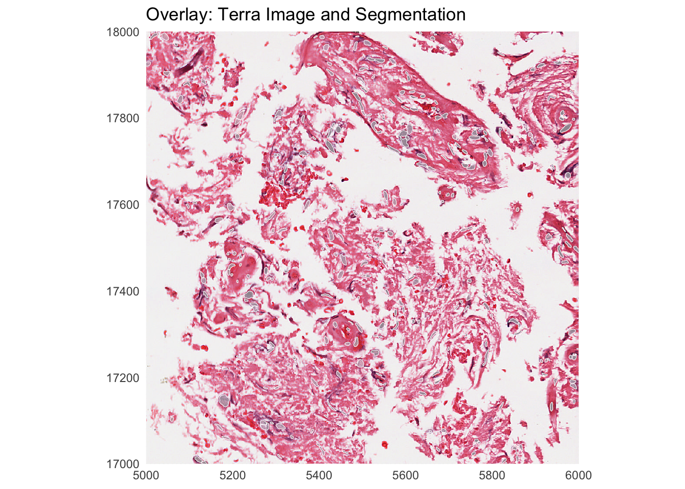
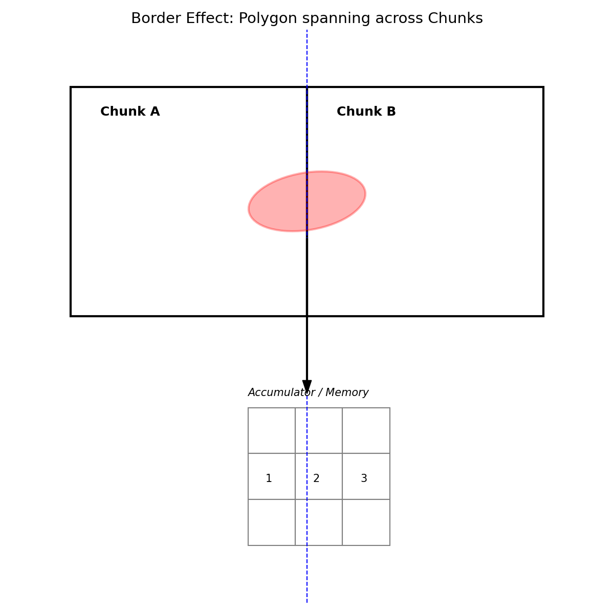

# Image and segmentation data manipulation and visualization

Authors: Mike Smith [@grimbough], Riccardo Ceccaroni [@riccardoc95], Carissa Chen [@carissaynchen], Davide Risso [@drisso]

## Goals

- Benchmark ways of reading and subsetting polygons
- Benchmark ways of reading and subsetting images
- Compute simple pixel statistics (e.g., mean intensity) per polygon

Our understanding is that this complements existing functionalities of spatialdata and can be a building block of a future pull request.

## Preliminary work

### Example data

- We downloaded one TCGA H&E image from the TCGAImage project. The nuclei were segmented with HoverNet. 
- Segmentation polygons are available in three different file formats (json/geojson, h5ad, parquet)
- The goal is to measure time and memory usage of a simple task: read the file, subset to a small region, and plot.

Prelminary steps:

- Create parquet file from geojson using duckdb.
- Create Zarr and OME-TIFF images starting from the original svs file.
- Explore existing approaches:
    - https://github.com/waldronlab/HistoImagePlot
    - https://cran.r-project.org/web/packages/geojsonsf/index.html

What we have learned:

- The h5ad files do not contain true polygons, only bounding boxes and centroids.
- The geojson files contain the polygons for each segmented nucleus.
- The json files contain the polygons + the bounding box for each segmented nucleus + the centroid + metadata.
- The HistoImagePlot package only plots centroids does not attempt to plot polygons.
- The duckspatial package allows for spatial queries without loading polygons in memory (supports parquet and geojson).
- We used a python script to convert json to geojson and from geojson to parquet

We now have the same segmentation in geojson, and parquet.

### Polygons

Starting from the nuclear segmentation in geojson and parquet:

- We are able to subset a geoparquet file with polygons, subset it out of memory and plot an overlay of the polygons and the image.
- We learned that duckspatial can work with both GEOJSON and geoparquet but parquet is about 50x faster to pick 500 polygons from 300k.

### Image cropping

- We successfully read a huge image in both OME-TIFF and Zarr format, without loading it in memory.
- We are able to crop a small region and plot the cropped image.
- We learned that we can use terra to easily work with huge images with lazy loading. This can be extended to working with zarr files with ZarrArray.

### Mid-life crisis

Are we just re-inventing `terra`?

Appropriate... as today is Earth day (thanks Ilaria!).

## Implementation

- We need to make our function aware of the zarr chunk geometry
- ZarrArray provides a good starting point, but implements only "simple" functions (e.g., colMeans, rowSums, ...)
- Our case is more complicated, because in addition to the zarr chunk geometry, we need to retrieve the polygons in the parquet file, but random access to parquet is super fast
- Main idea: iterate over image chunks (highest resolution), retrieve appropriate polygons from parquet, convert them into a labelled mask, use the existing spatialdata functions to compute e.g., mean intensity by label.

### Achievements

- We have a prototype R function to compute simple statistics (area, mean intensity, etc), but it needs a mask (from the polygons).
- We have an R function that converts polygons into labels (mask).
- We know how to iterate over zarr chunks with ZarrArray
- We have an R function that efficiently retrieves a set of polygons that align with the chunk from the parquet file (out of memory)
- Proof-of-principle implementation of the whole approach, which sidesteps the border polygons by dropping them

### Issues

The main issue is border effects: what happens if polygons are only partially in the window?

We have thought of three possible strategies, in order of simplicity:

1. Throw away the overlapping shapes (data loss)
2. Read the adjacent chunks with each chunk (efficiency loss)
3. Distribute the computations over multiple chunks for those polygons that overlap chunks (limit the number of functions we can use)
4. Store in memory the pixel set of the part of the objects that are in the window and compute the statistics when the whole image data for that polygon is available.
5. Going through the polygons, understand what is the best path of reading chunks that minimizes reading from zarr.

Related packages: SOPA, dask-image, multiview-stitcher.

We believe strategy 4 or 5 are the best approaches, but we started to implement strategy 1 to test the whole algorithm before dealing with complicated cases (also, only very few polygons are lost when few chunks and many objects).

## Project Structure and Pipeline Summary (from Gemini)

The project is organized into a preprocessing pipeline (Python/Shell) and an analysis/benchmarking framework (R/Quarto).

### 1. Data Acquisition & Preprocessing (`inst/`)
This stage prepares the raw data for efficient analysis in R.
- `download_example.sh`: Downloads the raw SVS image and HoverNet segmentation JSON.
- `json2geojson.py`: Converts segmentation JSON to GeoJSON, applying a scale factor to align with the image coordinates.
- `geojson2parquet.py`: Converts GeoJSON to Parquet using `geopandas` for fast spatial queries.
- `svs2zarr.py` & `svs2ometiff.py`: Converts the raw SVS image to cloud-optimized formats (Zarr/OME-TIFF) using `spatialdata` and `openslide`.
- `preprocess_dataset.py`: Orchestrates the entire conversion pipeline.

### 2. Core R Implementation (`R/`)
Contains the foundational functions for the "chunked" analysis strategy.
- `read_geoparquet.R`: Implements efficient, out-of-memory filtering of polygons using `duckdb`.
- `regionprops.R`: Provides functions to compute morphological and intensity-based statistics (area, eccentricity, mean intensity) for labeled regions.
- `zarr_chunk_strategy.R`: **The core implementation.** It implements "Strategy 3": iterating over Zarr chunks, fetching overlapping polygons from Parquet via `duckspatial`, and computing statistics incrementally.

### 3. Analysis & Benchmarking (`quarto/`)
Quarto documents used for exploration, visualization, and performance testing.
- `ImageCrop.qmd`: Benchmarks different ways to crop large images (Zarr vs. OME-TIFF) and overlay polygons using `terra`, `ImageArray`, and `duckspatial`.
- `HistoImagePlot.qmd`: Explores centroid-based visualization using the `HistoImagePlot` package.
- `compute-by-polygon.qmd`: Prototype for computing intensity statistics starting from Zarr arrays.
- `lazyPlot.qmd`: Benchmarks lazy loading and spatial filtering of polygons from Parquet files.

### Missing Pieces & Future Work
- **Advanced Border Handling:** Current implementations (Strategy 1) drop or simplify polygons that overlap chunk boundaries. Implementation of Strategy 4 (accumulating pixel sets) or Strategy 5 (optimized chunk traversal) is needed to avoid artifacts.
- **SpatialData Integration:** Better alignment and formal integration with the `spatialdata` R ecosystem.
- **Parallelization:** The chunk-based iteration in `zarr_chunk_strategy.R` is designed to be "embarrassingly parallel" but currently runs sequentially.
- **Generalization:** Generalizing scripts to handle arbitrary datasets beyond the TCGA example (e.g., removing hardcoded scale factors and paths).

